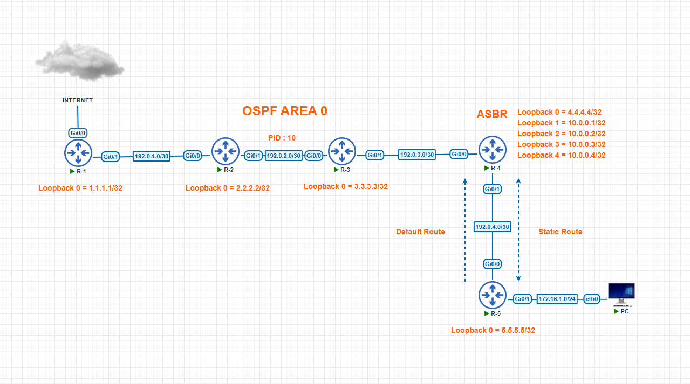
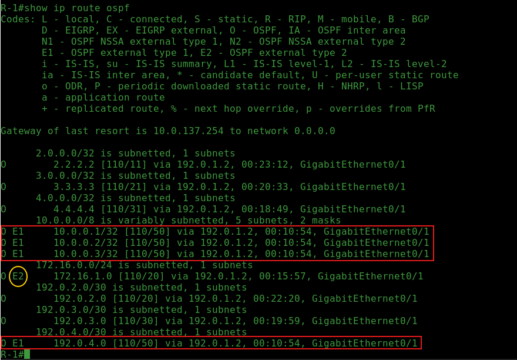
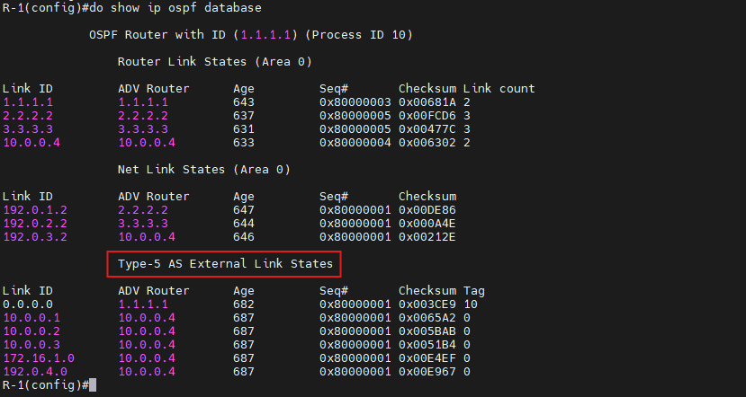
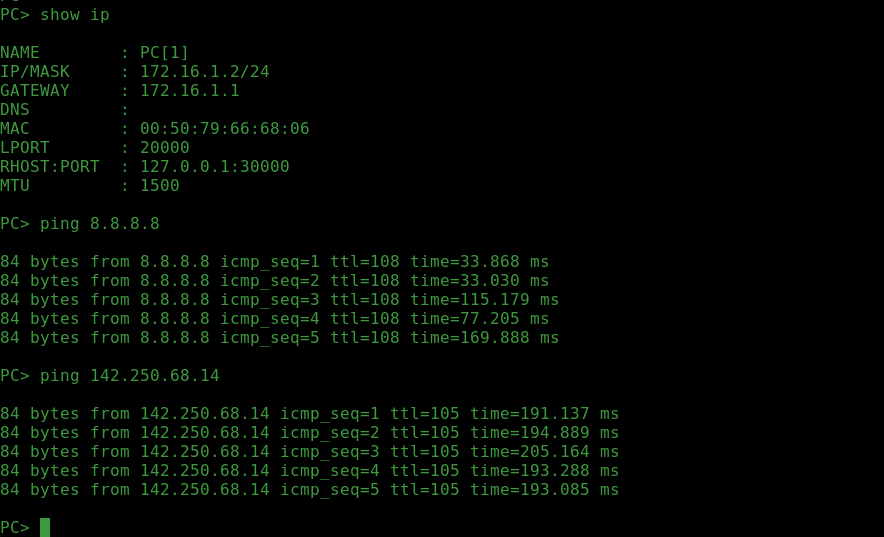
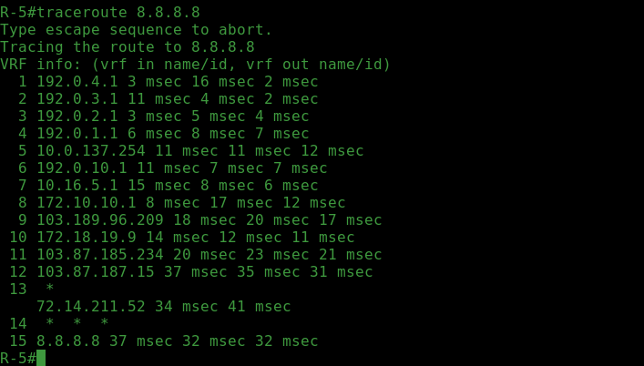
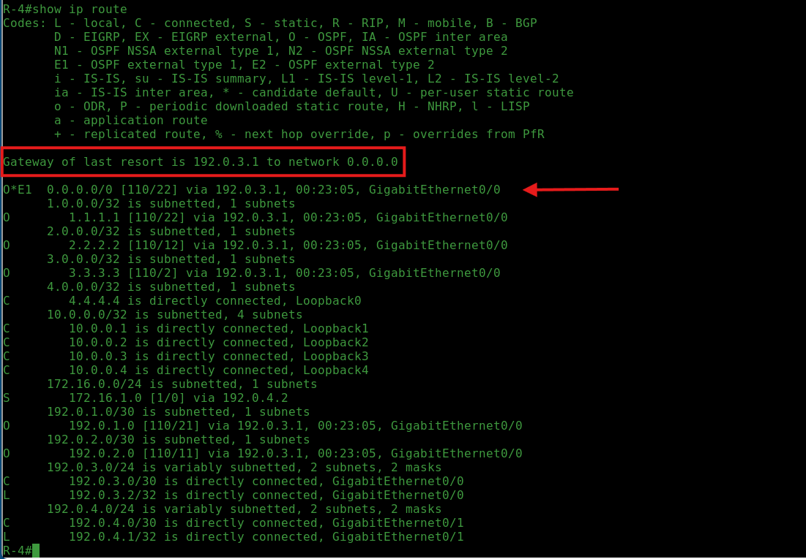

# Konfigurasi-OSPF-Redistribution-dan-Route-Filtering-di-Cisco

### Overview :
Di repository ini, saya mendokumentasikan konfigurasi OSPF pada router Cisco, lengkap dengan implementasi fitur redistribution dan route filtering. Tujuan utama dari dokumentasi ini adalah sebagai panduan praktis yang mudah dipahami bagi siapa pun yang ingin mempelajari atau mengimplementasikan OSPF dalam skenario jaringan Cisco yang lebih kompleks.

Perlu dicatat bahwa lab ini tidak dimaksudkan sebagai acuan best practice untuk implementasi di dunia nyata. Konfigurasi yang dilakukan bersifat eksperimental dan digunakan sebagai sarana pembelajaran, di mana saya bebas mengeksplorasi berbagai parameter sesuai kebutuhan dan keingintahuan pribadi.

### TOPOLOGY



### IP ADDRESS TABLE

|Hostname           |Interface          |IP Adrress        |Description      |
|-------------------|-------------------|------------------|-----------------|
|R-1                | G0/0              | DHCP Client      | WAN             |
|                   | G0/1              | 192.0.1.1/30     | R1 <--> R2      |  
|                   | Loopback 0        | 1.1.1.1/32       | Loopback        |
|R-2                | G0/0              | 192.0.1.2/30     | R2 <--> R1      |
|                   | G0/1              | 192.0.2.1/30     | R2 <--> R3      |
|                   | Loopback 0        | 2.2.2.2/32       | Loopback        |
|R-3                | G0/0              | 192.0.2.2/30     | R3 <--> R2      |
|                   | G0/1              | 192.0.3.1/30     | R3 <--> R4      |
|                   | Loopback 0        | 3.3.3.3/32       | Loopback        |
|R-4                | G0/0              | 192.0.3.2/30     | R4 <--> R3      |
|                   | G0/1              | 192.0.4.1/30     | R4 <--> R5      |
|                   | Loopback 0        | 4.4.4.4/32       | Loopback        |
|                   | Loopback 1        | 10.0.0.1/32      | Loopback        |
|                   | Loopback 2        | 10.0.0.2/32      | Loopback        |
|                   | Loopback 3        | 10.0.0.3/32      | Loopback        |
|                   | Loopback 4        | 10.0.0.4/32      | Loopback        |
|R-5                | G0/0              | 192.0.4.2/30     | R5 <--> R4      |
|                   | G0/1              | 172.16.1.1/24    | LAN             |
|                   | Loopback 0        | 5.5.5.5/32       | Loopback        |


### PER-DEVICE IP CONFIGURATION 
Sebelum mulai konfigurasi OSPF, langkah pertama yang saya lakukan adalah mengatur IP address di masing-masing perangkat. Ini penting supaya semua device bisa saling terhubung dengan benar. Saya juga menambahkan konfigurasi untuk nat outside dan inside di interface GigabitEthernet0/0 dan GigabitEthernet0/1.
#### Router 1 (R-1)
```Bash
R-1(config) interface gigabitEthernet 0/0
R-1(config-if) ip address dhcp
R-1(config-if) description WAN
R-1(config-if) duplex full
R-1(config-if) bandwidth 1024000
R-1(config-if) ip nat outside
R-1(config-if) no shutdown
R-1(config-if) exit
R-1(config) interface gigabitEthernet 0/1
R-1(config-if) ip address 192.0.1.1 255.255.255.252
R-1(config-if) description R1<-->R2
R-1(config-if) duplex full
R-1(config-if) bandwidth 10240000
R-1(config-if) ip nat inside
R-1(config-if) no shutdown
R-1(config-if) exit
R-1(config) interface lo0
R-1(config-if) ip address 1.1.1.1 255.255.255.255
R-1(config-if) exit
R-1(config)
```
#### Router 2 (R-2)
```Bash
R-2(config) interface gigabitEthernet 0/0
R-2(config-if) ip address 192.0.1.2 255.255.255.252
R-2(config-if) description R2<-->R1
R-2(config-if) duplex full
R-2(config-if) bandwidth 10240000
R-2(config-if) no shutdown
R-2(config-if) exit
R-2(config) interface gigabitEthernet 0/1
R-2(config-if) ip address 192.0.2.1 255.255.255.252
R-2(config-if) description R2<-->R3
R-2(config-if) duplex full
R-2(config-if) bandwidth 1024000
R-2(config-if) no shutdown
R-2(config-if) exit
R-2(config) interface lo0
R-2(config-if) ip address 2.2.2.2 255.255.255.255
R-2(config-if) exit
R-2(config)
```
#### Router 3 (R-3)
```Bash
R-3(config) interface gigabitEthernet 0/0
R-3(config-if) ip address 192.0.2.2 255.255.255.252
R-3(config-if) description R3<-->R2
R-3(config-if) duplex full
R-3(config-if) bandwidth 10240000
R-3(config-if) no shutdown
R-3(config-if) exit
R-3(config) interface gigabitEthernet 0/1
R-3(config-if) ip address 192.0.3.1 255.255.255.252
R-3(config-if) description R3<-->R4
R-3(config-if) duplex full
R-3(config-if) bandwidth 1024000
R-3(config-if) no shutdown
R-3(config-if) exit
R-3(config) interface lo0
R-3(config-if) ip address 3.3.3.3 255.255.255.255
R-3(config-if) exit
R-3(config)
```

#### Router 4 (R-4)
```Bash
R-4(config) interface gigabitEthernet 0/0
R-4(config-if) ip address 192.0.3.2 255.255.255.252
R-4(config-if) description R4<-->R3
R-4(config-if) duplex full
R-4(config-if) bandwidth 10240000
R-4(config-if) no shutdown
R-4(config-if) exit
R-4(config) interface gigabitEthernet 0/1
R-4(config-if) ip address 192.0.4.1 255.255.255.252
R-4(config-if) description R4<-->R5
R-4(config-if) duplex full
R-4(config-if) bandwidth 1024000
R-4(config-if) no shutdown
R-4(config-if) exit
R-4(config) interface lo0
R-4(config-if) ip address 4.4.4.4 255.255.255.255
R-4(config-if) interface lo1
R-4(config-if) 
R-4(config-if) 
R-4(config-if) exit
R-4(config)
```
#### Router 5 (R-5)
```Bash
R-5(config) interface gigabitEthernet 0/0
R-5(config-if) ip address 192.0.4.2 255.255.255.252
R-5(config-if) description R5<-->R4
R-5(config-if) duplex full
R-5(config-if) bandwidth 10240000
R-5(config-if) no shutdown
R-5(config-if) exit
R-5(config) interface gigabitEthernet 0/1
R-5(config-if) ip address 172.16.1.1 255.255.255.0
R-5(config-if) description LAN
R-5(config-if) duplex full
R-5(config-if) bandwidth 1024000
R-5(config-if) no shutdown
R-5(config-if) exit
R-5(config) interface lo0
R-5(config-if) ip address 3.3.3.3 255.255.255.255
R-5(config-if) exit
R-5(config)
```

### OSPF CONFIGURATION
Setelah seluruh perangkat dikonfigurasi dengan IP Address masing-masing, langkah selanjutnya adalah melakukan konfigurasi OSPF. Proses dimulai dengan membangun peering antar-neighbor sebelum melanjutkan ke tahap konfigurasi redistribusi dan route filtering. Di router 1 saya menambahkan perintah `default-information originate metric-type 1` yang berfungsi untuk mendistribusikan default gateway ke seluruh jaringan OSPF. Dalam konfigurasi ini, saya menggunakan metric type 1 (setara dengan if-installed pada perangkat Mikrotik)

#### Router 1 <--> Router 2
```Bash
R-1(config) Router ospf 10
R-1(config-router) network 192.0.1.0 0.0.0.3 area 0
R-1(config-router) network 1.1.1.1 0.0.0.0 area 0
R-1(config-router) passive-interface loopback 0
R-1(config-router) passive-interface GigabitEthernet 0/0
R-1(config-router) default-information originate metric-type 1
R-1(config-router) log-adjacency-changes
```
#### Router 2 <--> Router 1 & Router 2 <--> Router 3
```Bash
R-2(config) Router ospf 10
R-2(config-router) network 192.0.1.0 0.0.0.3 area 0
R-2(config-router) network 192.0.2.0 0.0.0.3 area 0
R-2(config-router) network 2.2.2.2 0.0.0.0 area 0
R-2(config-router) passive-interface loopback 0
R-2(config-router) log-adjacency-changes
```
#### Router 3 <--> Router 2 & Router 3 <--> Router 4
```Bash
R-3(config) Router ospf 10
R-3(config-router) network 192.0.2.0 0.0.0.3 area 0
R-3(config-router) network 192.0.3.0 0.0.0.3 area 0
R-3(config-router) network 3.3.3.3 0.0.0.0 area 0
R-3(config-router) passive-interface loopback 0
R-3(config-router) log-adjacency-changes
```
#### Router 4 <--> Router 3
Di Router 4, OSPF hanya diaktifkan pada interface yang terhubung ke Router 3, yaitu GigabitEthernet0/0. Sementara untuk koneksi menuju network 172.16.1.0/24 yang berada di Router 5, saya menggunakan static route. Karena interface GigabitEthernet0/1 digunakan dalam konfigurasi static route dan tidak membentuk adjacency OSPF, maka interface tersebut dimasukkan ke dalam daftar passive-interface.
```Bash
R-4(config) Router ospf 10
R-4(config-router) network 192.0.3.0 0.0.0.3 area 0
R-4(config-router) network 4.4.4.4 0.0.0.0 area 0
R-4(config-router) passive-interface loopback 0
R-4(config-router) passive-interface loopback 1
R-4(config-router) passive-interface loopback 2
R-4(config-router) passive-interface loopback 3
R-4(config-router) passive-interface GigabitEthernet 0/1
R-4(config-router) log-adjacency-changes
```
### STATIC ROUTE & DEFAULT ROUTE
Saya akan melakukan redistribusi terhadap static route dan connected route, oleh karena itu saya mengonfigurasi static route pada Router 4 menuju Router 5 untuk mencapai network 172.16.1.0/24. Selain itu, saya juga menambahkan default route di Router 5 dengan next hop mengarah ke Router 4.

#### Router 4
```Bash
R-4(config) ip route 172.16.1.0 255.255.255.0 192.0.4.2
R-4(config) do show ip route static # Verifikasi Apakah sudah ada table routing static
Codes: L - local, C - connected, S - static, R - RIP, M - mobile, B - BGP
       D - EIGRP, EX - EIGRP external, O - OSPF, IA - OSPF inter area 
       N1 - OSPF NSSA external type 1, N2 - OSPF NSSA external type 2
       E1 - OSPF external type 1, E2 - OSPF external type 2
       i - IS-IS, su - IS-IS summary, L1 - IS-IS level-1, L2 - IS-IS level-2
       ia - IS-IS inter area, * - candidate default, U - per-user static route
       o - ODR, P - periodic downloaded static route, H - NHRP, l - LISP
       a - application route
       + - replicated route, % - next hop override, p - overrides from PfR

Gateway of last resort is 192.0.3.1 to network 0.0.0.0

      172.16.0.0/24 is subnetted, 1 subnets
S        172.16.1.0 [1/0] via 192.0.4.2
R-4(config) do ping 172.16.1.2         # Verifikasi Ping ke Network 172.16.1.0/24
Type escape sequence to abort.
Sending 5, 100-byte ICMP Echos to 172.16.1.2, timeout is 2 seconds:
!!!!!
Success rate is 100 percent (5/5), round-trip min/avg/max = 2/7/23 ms
```
#### Router 5
```Bash
R-5(config) ip route 0.0.0.0 0.0.0.0 192.0.4.1
```

### REDISTRIBUTION & ROUTE FILTERING
Pada tahap ini, kita memasuki topik utama dalam konfigurasi routing lanjutan, yaitu route redistribution dan route filtering. Kedua proses ini memungkinkan pertukaran dan pengendalian informasi routing antar protokol yang berbeda, maupun antar routing instances yang berbeda dalam satu protokol. Dengan menerapkan redistribution dan filtering secara tepat, jaringan dapat beroperasi secara lebih terintegrasi, efisien, dan sesuai dengan kebijakan kontrol rute yang diinginkan.

Perlu dicatat bahwa saya akan melakukan redistribusi terhadap connected network dan static route. Namun, tidak semua connected network akan disertakan dalam proses redistribusi. Hanya jaringan-jaringan tertentu yang dianggap relevan dengan kebutuhan routing yang akan didistribusikan. Berikut adalah daftar connected network yang akan diikutsertakan dalam route redistribution:

**1. 192.0.4.0/30**

**2. 10.0.0.1/32**

**3. 10.0.0.2/32**

**4. 10.0.0.3/32**

Karena tidak semua network akan didistribusikan, maka diperlukan pembuatan prefix list dan route-map untuk mengontrol proses redistribusi. Prefix list digunakan untuk menentukan jaringan mana saja yang diperbolehkan, sementara route-map berfungsi untuk melakukan match terhadap prefix yang telah ditentukan, kemudian mengizinkan (permit) redistribusinya sesuai kebijakan yang diinginkan.

#### PREFIX LIST
```Bash
R-4(config) ip prefix-list OSPFV2-REDIS-CONN seq 10 permit 192.0.4.0/30
R-4(config) ip prefix-list OSPFV2-REDIS-CONN seq 20 permit 10.0.0.1/32
R-4(config) ip prefix-list OSPFV2-REDIS-CONN seq 30 permit 10.0.0.2/32
R-4(config) ip prefix-list OSPFV2-REDIS-CONN seq 40 permit 10.0.0.3/32
```
#### ROUTE-MAP
```Bash
R-4(config) route-map OSPFV2-REDIS-CONN permit 10
R-4(config-route-map) match ip address prefix-list OSPFV2-REDIS-CONN
R-4(config-route-map) exit
```
#### REDISTRIBUTION CONNECTED ROUTE
```Bash
R-4(config) router ospf 10
R-4(config-router) redistribute connected metric-type 1 subnets route-map OSPFV2-REDIS-CONN
```
#### REDISTRIBUTION STATIC ROUTE
```Bash
R-4(config-router) redistribute static subnets
R-4(config-router) exit
```
### VERIFICATION
Setelah konfigurasi route redistribution dan route filtering selesai dilakukan, langkah selanjutnya adalah melakukan proses verifikasi untuk memastikan bahwa konfigurasi telah berjalan sesuai dengan yang diharapkan. Verifikasi ini bertujuan untuk memastikan bahwa rute yang di-redistribusikan telah diterima dengan benar oleh router tujuan, dan bahwa filtering berfungsi sebagaimana mestinya sesuai dengan kebijakan yang telah ditetapkan.

#### ROUTING TABLE



Dari output di atas, terlihat bahwa route redistribution telah berhasil diterapkan sesuai dengan kebijakan route filtering yang dikonfigurasi. Hal ini dibuktikan dengan tidak munculnya network 10.0.0.4/32 di routing table, sesuai dengan filter yang diterapkan.

Terdapat beberapa entri dengan flag O E1, yang menunjukkan bahwa connected network telah berhasil di-redistribusi menggunakan OSPF external type 1. Selain itu, terlihat pula satu entri dengan flag O E2, yang menandakan bahwa static route juga berhasil didistribusikan sebagai OSPF external type 2.

#### LSDB



Redistribusi dilakukan di router 10.0.0.4 untuk memasukkan prefix dari static route dan connected route ke dalam domain OSPF sebagai Type-5 AS External LSA. Dengan bantuan route filtering menggunakan prefix-list dan route-map, hanya prefix yang diizinkan saja yang masuk ke LSDB dan disebarkan ke router-router lain di jaringan. Output dari perintah show ip ospf database menunjukkan bahwa redistribusi dan filtering berjalan sesuai harapan—hanya LSA untuk prefix yang di-permit yang muncul di database.

#### PING & TRACEROUTE






#### DEFAULT ROUTE




